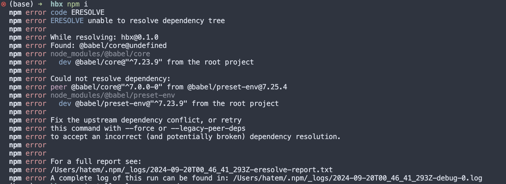
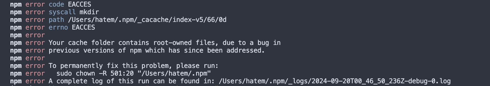

# Packship Installation Guide

**Packship** is a CLI tool designed to simplify the process of initializing new npm packages. It automates the creation of package directories, configuration files, and more, helping you set up packages faster and with less hassle.

This guide will walk you through installing Packship's dependencies and configuring Webpack.

## 1. Getting Started

### Packship Global Installation

#### For MacOS & Linux

```bash
sudo npm i -g packship@latest
```

#### For Windows

```bash
npm i -g packship@latest
```

---

### Setting Up Your Package with Packship

```bash
packship init
```

Follow the prompts, and your package will be ready!

> **Note:** For the best experience, we recommend initializing your packages with `packship init`. While you can use `packship publish` with any npm package, packages initialized with Packship will have access to optimized workflows and features.

## 2. Dependency Installation

### Initialize `node modules` and `package-lock.json`

Install the necessary dependencies to ensure your package runs smoothly.

```bash
npm install
```

If you encounter dependency resolution issues, similar to this:



Run the following command to install dependencies:

```bash
npm install --legacy-peer-deps
```

If you see an EACCES error, run the following command to fix permissions:



```bash
sudo chown -R $(whoami) "$(npm config get cache)"
```

Then, try installing the dependencies again:

```bash
npm install
```

If you encounter deprecated package warnings, you can safely ignore them or update the packages as needed.

Install the necessary dependencies to avoid redundancy and ensure proper package setup.

### Main Dependencies

#### For TypeScript

```bash
npm install --save typescript @types/react @types/react-dom
```

#### For JavaScript

```bash
npm install react react-dom
```

Make sure TypeScript and React typings are installed for development purposes. Install these commands only once to avoid duplication.

---

### Babel for React & TypeScript

Install Babel presets to compile TypeScript and JSX/React syntax:

#### For TypeScript

```bash
npm install --save-dev @babel/preset-typescript @babel/preset-react
```

#### For JavaScript

```bash
npm install --save-dev @babel/preset-react
```

---

### Babel & Webpack Loaders

Install the necessary loaders for Babel and Webpack:

```bash
npm install --save-dev babel-loader webpack
```

These loaders ensure that Webpack and Babel can work together to transpile and bundle your code.

## 3. Publishing Your Npm Package

To publish your package, ensure the build is successful:

```bash
npm run build
```

### For New Packages

Once the build succeeds, publish your package:

```bash
packship publish
```

### For Existing Packages

If you're updating an existing package, update the version and then publish:

```bash
npm version patch/minor/major      # Depending on your release
```

Then:

```bash
packship publish
```

## 4. Reporting Issues with Packship

If you encounter any issues with the Packship tool itself, you can report them directly from the terminal:

```bash
packship report
```

This command is specifically for reporting issues with the Packship CLI tool, not for issues with your npm package. For security and clarity, this command can only be run:

1. Outside of any package directory, or
2. Inside a package that was initialized with Packship

If you try to run this command in a package that wasn't initialized with Packship, you'll see an error message and the command will exit.

When you run this command in a valid context, you'll be given two options:

1. **Automatic Submission** - Submit the issue directly to GitHub from the terminal (requires a GitHub token)
2. **Manual Submission** - Get formatted issue content to copy and paste into GitHub's issue form

If you choose automatic submission and don't have a GitHub token set up, you'll be prompted to enter one. You can also set a GitHub token as an environment variable beforehand:

```bash
export GITHUB_TOKEN=your_github_token
```

The tool will guide you through collecting all necessary information about the issue, including optional system information to help with troubleshooting.

## Telemetry

PackShip collects anonymous usage data to help improve the tool. This data includes command usage (such as how many times `init` and `publish` commands are run) and error rates, but never includes personal information or code.

You can manage telemetry settings with the following commands:

```bash
# Check current telemetry status
packship telemetry status

# Enable telemetry
packship telemetry enable

# Disable telemetry
packship telemetry disable
```

Telemetry is opt-in and can be disabled at any time.

## Contributing

We welcome contributions to PackShip! Please see [CONTRIBUTING.md](CONTRIBUTING.md) for details on how to contribute.

## License

This project is licensed under the MIT License. See the [LICENSE.md](LICENSE.md) file for details.
